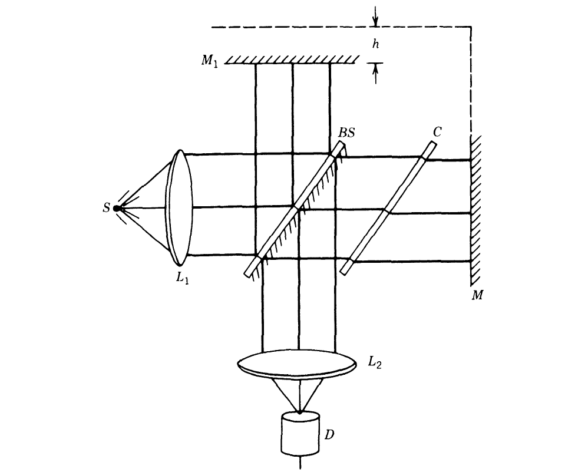
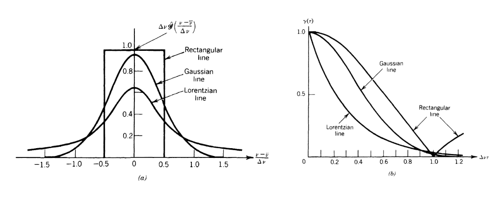
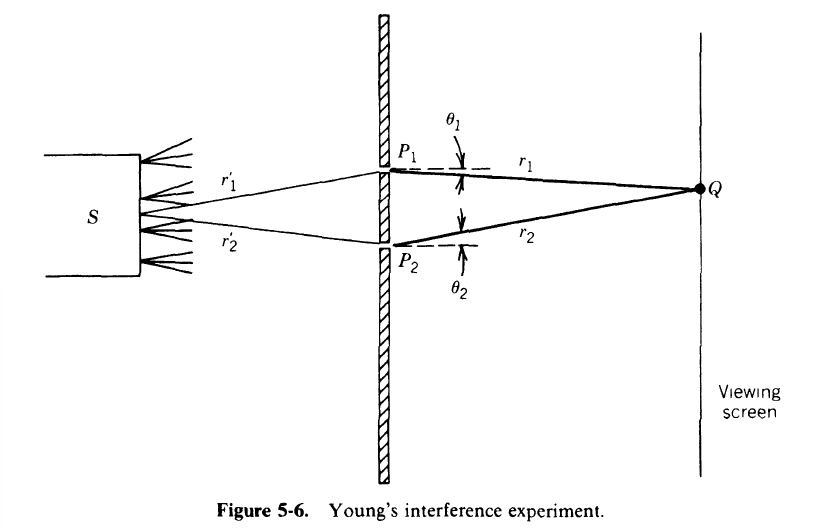
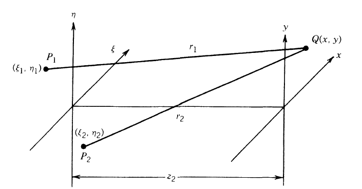

# Review on density matrix transform-based holography
The articles below demonstrates the way of propagation for the partial coherent electrons.
- *Falk Rödern, Axel Lubk, Transfer and reconstruction of the density matrix in off-axis electron holography, Ultramicroscopy 146 103-116, (2014)*

## Concepts
**TCC**: High-resolution images obtained from elastically scattered electrons are modulated by the combined influence of coherent lens aberrations and the  partially coherent source summarized in the transmission cross-coefficient (TCC).

**Scattering-induced decoherence**: Different inelastic
scattering processes [3–9] and statistical fluctuations within the object [10], within the energy and momentum distribution of the electron beam or within the surrounding environment [11–13] also change the coherence properties of the beam.

**MDFF**: the dynamic form factor was later generalized to the mixed dynamic form factor (MDFF) [15] incorporating also the off-diagonals (i.e. coherence).
- First Born approximation: MDFF is proportional to the cross-spectral density at the back focal plane.

**Mutual coherence function**: inverse temporal Fourier transformation of the cross-spectral density is called mutual coherence function in turn [17, 18]

## Core equations
#### Density matrix of the probe electron
Flux of the pure state

$$
\mathbf{j}=\frac{\hbar}{2 i m}\left(\psi_0^* \nabla \psi_0-\psi_0 \nabla \psi_0^*\right) \approx \frac{\hbar \mathbf{k}_0}{m}\left|\psi_0\right|^2
$$

Probability density of the electron beam

$$
\rho_s(\mathbf{r})=\sum_{i j} \psi_i(\mathbf{r}) \psi_j^*(\mathbf{r})\left\langle\tau_j \mid \tau_i\right\rangle=\sum_i\left|\psi_i(\mathbf{r})\right|^2
$$

#### Electron source
In Fourier space:

$$
\rho_b\left(\mathbf{k}_{\perp}, \mathbf{k}_{\perp}^{\prime}, E\right)=f_{\mathrm{C}}(E) f_{\mathrm{S}}\left(\mathbf{k}_{\perp}\right) \delta\left(\mathbf{k}_{\perp}-\mathbf{k}_{\perp}^{\prime}\right)
$$

In real space:

$$
\rho_b\left(\mathbf{r}, \mathbf{r}^{\prime}, E\right)=\mathrm{FT}^{-1}\left[\rho_b\left(\mathbf{k}_{\perp}, \mathbf{k}_{\perp}^{\prime}, E\right)\right]=f_{\mathrm{C}}(E) \tilde{f}_{\mathrm{S}}\left(\mathbf{r}-\mathbf{r}^{\prime}\right)
$$

***Degree of spatial coherence***

$$
\mu(\mathbf{d})=\frac{\int \rho_b(\mathbf{d}, E) \mathrm{d} E}{\int \rho_b(0, E) \mathrm{d} E}=\tilde{f}_S(\mathbf{d})
$$

#### Object

In case of small illumination
apertures in the order of 0.1 mrad and energy fluctuations $E_c$ small compared to the kinetic energy of the beam, it can be assumed that each incoming electron of the electron beam is scattered in the same way, resulting in $\rho_s(\mathbf{r},\mathbf{r'},E)$.

$$
\begin{aligned}
\rho_o\left(\mathbf{r}, \mathbf{r}^{\prime}, E\right)= & \int \mathrm{e}^{2 \pi i\left(\mathbf{q r}-\mathbf{q}^{\prime} \mathbf{r}^{\prime}\right)} f_{\mathrm{S}}\left(\mathbf{k}_{\perp}\right) f_{\mathrm{C}}\left(E_{\mathrm{C}}\right) \\
& \times \rho_{\mathrm{s}}\left(\mathbf{q}-\mathbf{k}_{\perp}, \mathbf{q}^{\prime}-\mathbf{k}_{\perp}, E-E_{\mathrm{C}}\right) \mathrm{d}^2 k_{\perp} \mathrm{d} E_{\mathrm{C}} \mathrm{~d}^2 q \mathrm{~d}^2 q^{\prime} \\
= & \int \rho_b\left(\mathbf{r}-\mathbf{r}^{\prime}, E_{\mathrm{C}}\right) \rho_{\mathrm{s}}\left(\mathbf{r}, \mathbf{r}^{\prime}, E-E_{\mathrm{C}}\right) \mathrm{d} E_{\mathrm{C}}
\end{aligned}
$$

#### Focal plane

Isoplanatic aberrations of the objective lens can be described as phase shifts through the wave aberration function $\chi(\mathbf{q}, E)$ at the back focal plane.

$$
\operatorname{WTF}\left(\mathbf{q}, \mathbf{q}^{\prime}, E\right)=\mathrm{e}^{-i\left(\chi\left(\mathbf{q}^{\prime}, E\right)-\chi\left(\mathbf{q}^{\prime}, E\right)\right)}
$$

therefore, the density matrix at the back focal plane is

$$
\begin{aligned}
\rho_{f p}\left(\mathbf{q}, \mathbf{q}^{\prime}\right)= & \int \rho_{\mathrm{s}}\left(\mathbf{q}-\mathbf{k}_{\perp}, \mathbf{q}^{\prime}-\mathbf{k}_{\perp}, E\right) f_{\mathrm{S}}\left(\mathbf{k}_{\perp}\right) \mathrm{d}^2 k_{\perp} \\
\times & \int f_{\mathrm{C}}\left(E_{\mathrm{c}}\right) \mathrm{WTF}\left(\mathbf{q}, \mathbf{q}^{\prime}, E+E_{\mathrm{c}}\right) \mathrm{d} E_{\mathrm{c}} \mathrm{~d} E .
\end{aligned}
$$

Note that the spatial coherence induces a blurring of the momentum space density matrix, while the temporal coherence dampens the off-diagonal elements only (*responsible for fringe constrast damping in CBED holography* [56]). Thus,

$$
I_{f p}(\mathbf{q})=\int \rho_s\left(\mathbf{q}-\mathbf{q}_0, \mathbf{q}-\mathbf{q}_0, E\right) f_{\mathrm{S}}\left(\mathbf{q}_0\right) \mathrm{d}^2 q_0 \mathrm{~d} E
$$

#### Image plane

$$
\begin{aligned}
\rho_i\left(\mathbf{r}, \mathbf{r}^{\prime}\right)= & \int \mathrm{e}^{2 \pi i\left(\mathbf{q}-\mathbf{q}^{\prime} \mathbf{r}^{\prime}\right)} \mathrm{WTF}\left(\mathbf{q}, \mathbf{q}^{\prime}, E+E_{\mathrm{c}}\right) \rho_{\mathrm{s}}\left(\mathbf{q}-\mathbf{k}_{\perp}, \mathbf{q}^{\prime}-\mathbf{k}_{\perp}, E\right) \\
& \times f_{\mathrm{S}}\left(\mathbf{k}_{\perp}\right) f_{\mathrm{C}}\left(E_{\mathrm{c}}\right) \mathrm{d}^2 k_{\perp} \mathrm{d}_{\mathrm{c}} \mathrm{~d}^2 q \mathrm{~d}^2 q^{\prime} \mathrm{d} E .\\
= & \int \mathrm{e}^{2 \pi i\left(\mathbf{q}-\mathbf{q}^{\prime} \mathbf{r}^{\prime}\right)} \mathrm{TCC}\left(\mathbf{q}, \mathbf{q}^{\prime}, \mathbf{r}-\mathbf{r}^{\prime}, E\right) \rho_s\left(\mathbf{q}, \mathbf{q}^{\prime}, E\right) \mathrm{d}^2 q \mathrm{~d}^2 q^{\prime} \mathrm{d} E
\end{aligned}
$$

where 

$$
\begin{aligned}
\operatorname{TCC}\left(\mathbf{q}, \mathbf{q}^{\prime}, \mathbf{d}, E\right)= & \int \mathrm{e}^{2 \pi i \mathbf{k}_{\perp} \mathbf{d}} \mathrm{WTF}\left(\mathbf{q}+\mathbf{k}_{\perp}, \mathbf{q}^{\prime}+\mathbf{k}_{\perp}, E+E_{\mathrm{C}}\right) \\
& \times f_{\mathrm{S}}\left(\mathbf{k}_{\perp}\right) f_{\mathrm{C}}\left(E_{\mathrm{C}}\right) \mathrm{d}^2 k_{\perp} \mathrm{d} E_{\mathrm{c}} .
\end{aligned}
$$

## Statements
- van Hove showed in
1954 that the dynamic form factor relates the diffracted intensity
and density-density correlation in the object [14]
- van Cittert–
Zernike theorem in optics [53,54] stating that the spatial coherence in the far field is determined through the Fourier transform of the normalized source distribution $f_S$

## References
#### Inelstic scattering processes
[3] F.J. García de Abajo, Optical excitations in electron microscopy, Rev. Mod. Phys.
82 (2010) 209–275.

[4] A. Howie, Inelastic scattering of electrons by crystals: I. The theory of small-
angle inelastic scattering, Proc. R. Soc. Lond. A 271 (1963) 268–287.

[5] L. Reimer, R. Rennekamp, Imaging and recording of multiple scattering effects
by angular resolved electron energy loss spectroscopy, Ultramicroscopy 28
(1989) 258–265.

[6] Y.Y. Wang, S.C. Cheng, V.P. Dravid, F.C. Zhang, Momentum-transfer resolved
electron energy loss spectroscopy of solids: problems, solutions and applica-
tions, Ultramicroscopy 59 (1995) 109–119.

[7] L. Gu, V. Srot, W. Sigle, C. Koch, P. van Aken, F. Scholz, S.B. Thapa, C. Kirchner,
M. Jetter, M. Rühle, Band-gap measurements of direct and indirect semicon-
ductors using monochromated electrons, Phys. Rev. B 75 (2007) 195214.

[8] H. Kohl, H. Rose, Theory of image formation by inelastically scattered electrons
in the electron microscope, Adv. Electron. Electron Phys. 65 (1985) 173–227.

[9] S.L. Dudarev, L.-M. Peng, M.J. Whelan, Correlations in space and time and
dynamical diffraction of high-energy electrons by crystals, Phys. Rev. B
48 (1993) 13408.
F. Röder, A. Lubk / Ultramicroscopy 146 (2014) 103–116 115
#### Statistical fluctuations
[10] A. Rother (Lubk), T. Gemming, H. Lichte, The statistics of the thermal motion of
the atoms during imaging process in transmission electron microscopy and
related techniques, Ultramicroscopy 109 (2009) 139–146.
#### Surrounding environment effect
[11] F.J. García de Abajo, Optical emission from the interaction of fast electrons
with metallic films containing a circular aperture: a study of radiative
decoherence of fast electrons, Phys. Rev. Lett. 102 (2009) 237401.

[12] A. Howie, Mechanisms of decoherence in electron microscopy, Ultramicro-
scopy 111 (2011) 761–767.

[13] S. Uhlemann, H. Müller, P. Hartel, J. Zach, M. Haider, Thermal magnetic field
noise limits resolution in transmission electron microscopy, Phys. Rev. Lett.
111 (2013) 046101.

## Fundamental concepts
***Reference***: Statistical optics

#### Coherence
***References***
Particularly noteworthy early contributions were made by E. Verdet (Ref.
5-I), M. vonLaue (Ref. 5-2), M. Berek (Ref. 5-3), P. H. van Cittert (Ref.
5-4), F. Zernike (Ref. 5-5), and others.
In more recent times, developments
of major importance are found in the work of H. H. Hopkins (Ref. 5-6), A.
Blanc-Lapierre and P. Dumontet (Ref. 5-7), and E. Wolf (Ref. 5-8).
Available under the editorship of L.
Mandel and E. Wolf (Ref. 5-9).
For alternative discussions of much of the material covered here, the
reader can consult Refs. 5-10 through 5-14.

**Temporal coherence**
Concerned with the ability of a light beam to interfere with a delayed (but not spatially shifted) version of itself, referred as amplitude splitting.
- Michelson interferometer

Mathematical descriptions:

$$
\begin{aligned}
I_D = & \left\langle\left|K_1\mathbf{u}(t)+K_2\mathbf{u}\left(t+\frac{2h}{c}\right)\right|^2\right\rangle\\
= & K_1^2\langle|\mathbf{u}(t)|^2\rangle+K_2^2\left\langle\left|\mathbf{u}\left(t+\frac{2h}{c}\right)\right|^2\right\rangle\\
& +K_1 K_2\left\langle\mathbf{u}\left(t+\frac{2 h}{c}\right) \mathbf{u}^*(t)\right\rangle \\
& +K_1 K_2\left\langle\mathbf{u}^*\left(t+\frac{2 h}{c}\right) \mathbf{u}(t)\right\rangle \\
= &(K_1^2+K_2^2)I_0+2K_1K_2\Re\left\{\Gamma\left(\frac{2h}{c}\right)\right\}
\end{aligned}
$$

where $I_0 \triangleq\langle | \mathbf{u}(t)|^2\rangle=\langle | \mathbf{u}(t+\frac{2 h}{c})|^2\rangle$, $\Gamma(\tau)=\langle\mathbf{u}(t+\tau)\mathbf{u}^*(t)\rangle$, sometimes normalized as

$$
\mathbf{\gamma}(\tau)=\frac{\Gamma(\tau)}{\Gamma(0)}
$$

which is not greater than 1, which can be substituted by

$$
\mathbf{\gamma}(\tau)=\gamma(\tau) \exp \{-j[2 \pi \bar{\nu} \tau-\alpha(\tau)]\}
$$

For the case $K_1=K_2=K$, and noting that $\mathbf{\bar{\nu}}/c=1/\bar{\lambda}$,

$$
I_D(h)=2 K^2 I_0\left\{1+\gamma\left(\frac{2 h}{c}\right) \cos \left[2 \pi\left(\frac{2 h}{\bar{\lambda}}\right)-\alpha\left(\frac{2 h}{c}\right)\right]\right\}
$$

Which indicates that the visibility of a sinusodial fringe pattern can be quantified, defined by

$$
\mathscr{V} \triangleq \frac{I_{\max }-I_{\min }}{I_{\max }+I_{\min }}
$$

satisfies

$$
\mathscr{\gamma}(h)=\left|\boldsymbol{\mathbf{\gamma}}\left(\frac{2 h}{c}\right)\right|=\gamma\left(\frac{2 h}{c}\right)
$$

in general,

$$
\mathscr{V}(h)=\frac{2 K_1 K_2}{K_1^2+K_2^2} \gamma\left(\frac{2 h}{c}\right)
$$

As the pathlength difference 2h grows large, the visibility of the fringes drops, and we say that the relative coherence of the two beams has diminished. When the visibility has fallen to approximately zero, we say that the pathlength difference has exceeded the ***coherence length*** of the light, or equivalently, that the relative time delay has exceeded the ***coherence time***.

**Continuous case**

$$
\Gamma(\tau)=\int_0^{\infty} 4 \mathscr{G}^{(r, r)}(\nu) e^{-\jmath 2 \pi \nu \tau} d \nu
$$

thus,

$$
\gamma(\tau)=\frac{\int_0^{\infty} 4 \mathscr{G}^{(r, r)}(\nu) e^{-j 2 \pi \tau \nu} d \nu}{\int_0^{\infty} 4 \mathscr{G}^{(r, r)}(\nu) d \nu}=\int_0^{\infty} \hat{\mathscr{G}}(\nu) e^{-\jmath 2 \pi \nu \tau} d \nu
$$

Distribution of different distribution functions:

Guassian shape

$$
\hat{\mathscr{G}}(\nu) \cong \frac{2 \sqrt{\ln 2}}{\sqrt{\pi} \Delta \nu} \exp \left[-\left(2 \sqrt{\ln 2} \frac{\nu-\bar{\nu}}{\Delta \nu}\right)^2\right]
$$

$$
\boldsymbol{\gamma}(\tau)=\exp \left[-\left(\frac{\pi \Delta \nu \tau}{2 \sqrt{\ln 2}}\right)^2\right] \exp (-j 2 \pi \bar{\nu} \tau)
$$

Lorenzian shape

$$
\hat{\mathscr{G}}(\nu) \cong \frac{2(\pi \Delta \nu)^{-1}}{1+\left(2 \frac{\nu-\bar{\nu}}{\Delta \nu}\right)^2}
$$

Rectangular shape
$$
\hat{\mathscr{G}}(\nu)=\frac{1}{\Delta \nu} \operatorname{rect}\left(\frac{\nu-\bar{\nu}}{\Delta \nu}\right)
$$

Following Mandel (Ref. 5-18), the coherence time $\tau_c$ of the disturbance $\mathbf{u}(t)$ is defined by

$$
\tau_c\triangleq \int_{-\infty}^{\infty}|\mathbf{\gamma}(\tau)|^2d\tau
$$

listed as follows
$$
\begin{aligned}
& \tau_c=\sqrt{\frac{2 \ln 2}{\pi}} \cdot \frac{1}{\Delta \nu}=\frac{0.664}{\Delta \nu}&(\text{Gaussian line}) \\
& \tau_c=\frac{1}{\pi \Delta \nu}=\frac{0.318}{\Delta \nu}&(\text{Lorentzian line})\\
& \tau_c=1 / \Delta \nu &(\text{rectangular line})
\end{aligned}
$$

**Spatial coherence**
The ability of a light beam to
interfere with a spatially shifted (but not delayed) version of itself, referred as wavefront splitting.

Clearly, the ideas can
be generalized to allow both temporal and spatial shifting, which will lead
us to the concept of the **mutual coherence function**.

Young interferometer

The intensity is determined by the wavefunction
$$
I(Q)=\left\langle\mathbf{u}^*(Q, t) \mathbf{u}(Q, t)\right\rangle
$$
with
$$
\mathbf{u}(Q, t)=\mathbf{K}_1 \mathbf{u}\left(P_1, t-\frac{r_1}{c}\right)+\mathbf{K}_2 \mathbf{u}\left(P_2, t-\frac{r_2}{c}\right)
$$

For the Young's interference experiment

$$
\mathbf{K}_1 \cong \iint_{\substack{\text { pinhole } \\ P_1}} \frac{\chi\left(\theta_1\right)}{j \bar{\lambda} r_1} d S_1, \quad \mathbf{K}_2 \cong \iint_{\substack{\text { pinhole } \\ P_2}} \frac{\chi\left(\theta_2\right)}{j \bar{\lambda} r_2} d S_2
$$

Assume that

$$
\delta\ll\frac{\bar{\lambda}z}{D}
$$

it can be derived that
$$
\begin{aligned}
I(Q)= & |\mathbf{K}_1|^2\left\langle \left| \mathbf{u}(P_1, t-\frac{r_1}{c})\right|^2\right\rangle+\left|\mathbf{K}_2\right|^2\left\langle \left| \mathbf{u}(P_2, t-\frac{r_2}{c})\right|^2\right\rangle \\
& +\mathbf{K}_1 \mathbf{K}_2^*\left\langle\mathbf{u}\left(P_1, t-\frac{r_1}{c}\right) \mathbf{u}^*\left(P_2, t-\frac{r_2}{c}\right)\right\rangle \\
& +\mathbf{K}_1^* \mathbf{K}_2\left\langle\mathbf{u}^*\left(P_1, t-\frac{r_1}{c}\right) \mathbf{u}\left(P_2, t-\frac{r_2}{c}\right)\right\rangle\\\
=& I^{(1)}(Q)+I^{(2)}(Q)+2 \mathbf K_1 \mathbf K_2 \operatorname{Re}\left\{\mathbf\Gamma_{12}\left(\frac{r_2-r_1}{c}\right)\right\}
\end{aligned}
$$

Note that

$$
\left|\Gamma_{12}(\tau)\right| \leq\left[\Gamma_{11}(0) \Gamma_{22}(0)\right]^{1 / 2}
$$

Therefore a normalized quantity $\mathbf \gamma_{12}(\tau)$ can be defined as

$$
\gamma_{12}(\tau) \triangleq \frac{\Gamma_{12}(\tau)}{\left[\Gamma_{11}(0) \Gamma_{22}(0)\right]^{1 / 2}}
$$

Note that

$$
\begin{aligned}
& I^{(1)}(Q)=K_1^2 \Gamma_{11}(0) \\
& I^{(2)}(Q)=K_2^2 \Gamma_{22}(0)
\end{aligned}
$$

thus

$$
\begin{aligned}
I(Q)=&I^{(1)}(Q)+I^{(2)}(Q)+2 \sqrt{I^{(1)}(Q) I^{(2)}(Q)} \operatorname{Re}\left\{\boldsymbol{\gamma}_{12}\left(\frac{r_2-r_1}{c}\right)\right\}\\
=&I^{(1)}(Q)+I^{(2)}(Q)\\
+&2 \sqrt{I^{(1)}(Q) I^{(2)}(Q)} \gamma_{12}\left(\frac{r_2-r_1}{c}\right) \cos \left[2 \pi \bar{\nu}\left(\frac{r_2-r_1}{c}\right)-\alpha_{12}\left(\frac{r_2-r_1}{c}\right)\right]
\end{aligned}
$$

The fringe visibility is

$$
\mathscr{V}=\frac{2 \sqrt{I^{(1)} I^{(2)}}}{I^{(1)}+I^{(2)}} \gamma_{12}(0)
$$

**Geometric considerations**

**Comparisons**
| Symbol | Definition | Name | Temporal or Spatial Coherence |
| :---: | :---: | :---: | :---: |
| $\Gamma_{11}(\tau)$ | $\begin{aligned}& \left\langle\mathbf{u}\left(P_1, t+\tau\right) \mathbf{u}^*\left(P_1, t\right)\right\rangle \\& {\left[\text { Note } \Gamma_{11}(0)=I\left(P_1\right)\right]}\end{aligned}$ | Self coherence function | Temporal |
| $\gamma_{11}(\tau)$ | $\frac{\Gamma_{11}(\tau)}{\Gamma_{11}(0)}$ | Complex degree of (self) coherence | Temporal |
| $\Gamma_{12}(\tau)$ | $\left\langle\mathbf{u}\left(P_1, t+\tau\right) \mathbf{u}^*\left(P_2, t\right)\right\rangle$ | Mutual coherence function | Spatial and temporal |
| $\gamma_{12}(\tau)$ | $\frac{\Gamma_{12}(\tau)}{\left[\Gamma_{11}(0) \Gamma_{22}(0)\right]^{1 / 2}}$ | Complex degree of coherence | Spatial and temporal |
| $J_{12}$ | $\begin{aligned}& \left\langle\mathbf{u}\left(P_1, t\right) \mathbf{u}^*\left(P_2, t\right)\right\rangle \\& \quad=\Gamma_{12}(0)\end{aligned}$ | Mutual intensity | Spatial quasimonochromatic |
| $\mu_{12}$ | $\frac{J_{12}}{\left[J_{11} J_{22}\right]^{1 / 2}}=\gamma_{12}(0)$ | Complex coherence factor | Spatial quasimonochromatic |

